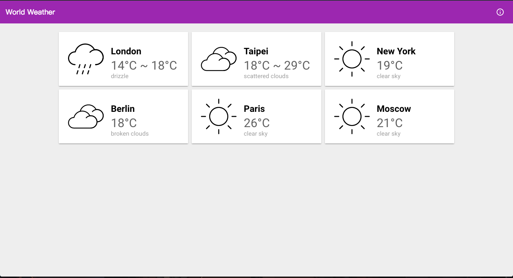

World Weather
=============
A simple sample app built with Polymer(1.0)

</img>

OpenWeatherMap API Key
----------------------
This sample use weather data from [OpenWeatherMap](https://openweathermap.org/). So please implement your own `api-key-storage` element inside `src/element/key-storage.html` file.

Sample imeplementation:
```
<script>
    Polymer({
        is: 'api-key-storage',

        properties: {
            openWeather: {
                type: String,
                value: 'YOUR_API_KEY',
                readOnly: true,
                notify: true
            }
        }
    });
</script>
```

For more information about how to get an API key, please refer the [official guide](https://openweathermap.org/appid).